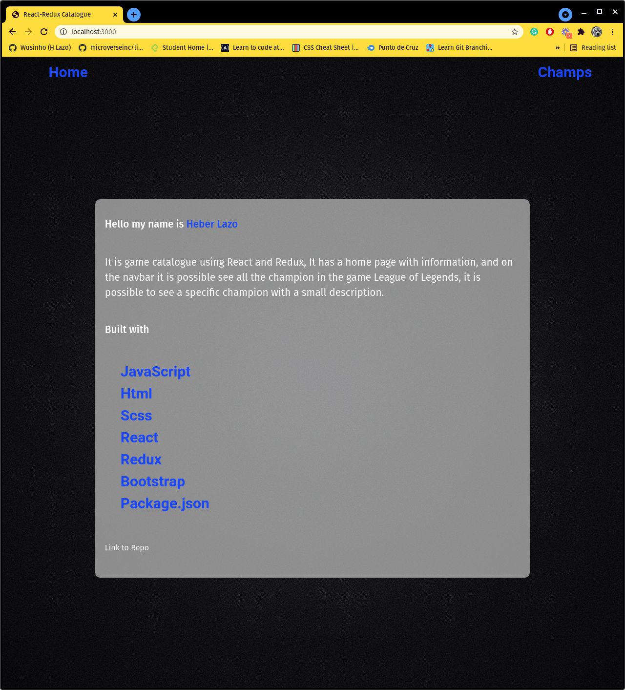
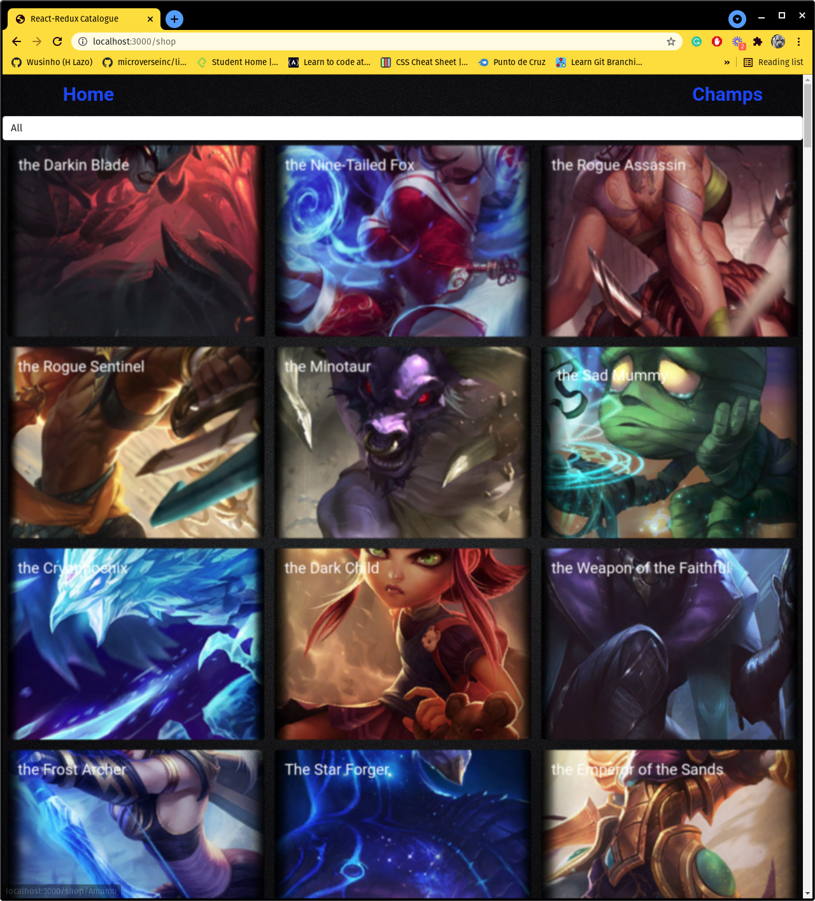
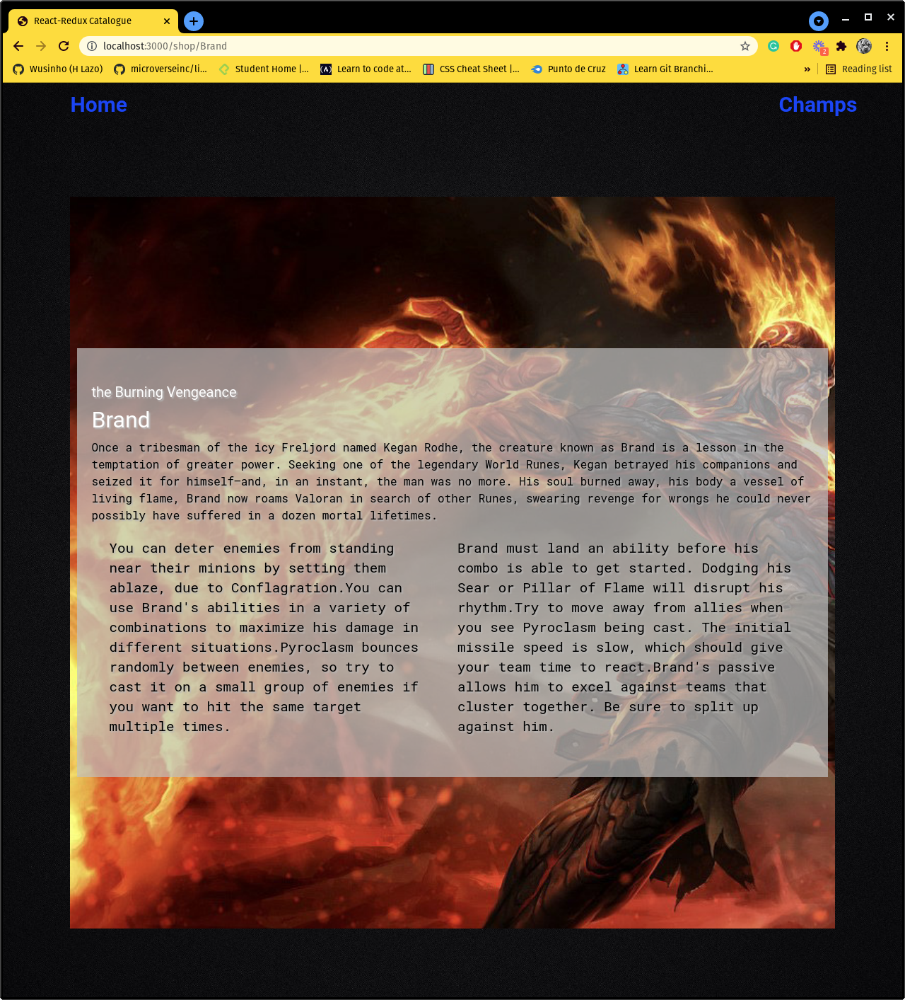
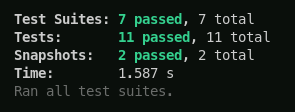

# React - Redux Catalogue

It is game catalogue based on #Catalogue of Recipes, using React and Redux, It has a home page with information, and on the navbar it is possible see all the champion in the game League of Legends, it is possible to see a specific champion with a small description.

## WebSite Sections
- Homepage, there is a small description of the project.

- Champions Catalogue, here is where the api is rendering.

- Single page with the selected item information.

## Live demo

[live demo](https://611c155ea8618b0008ba97ff--hungry-tereshkova-d0e975.netlify.app/)

## Built With

- JavaScript
- HTML
- SCSS
- React
- Redux
- Bootstrap
- Package.json

## How to start the project from your Local environment

- Open your terminal and cd where you want to store the project
- Run the following command - `git clone https://github.com/Wusinho/React-Redux-Catalogue.git `
- Cd into the directory - `cd fluffy-companion`
- Run `npm install` to install all dependencies
- To run the pogram type `npm run dev` on your terminal.
- By default it will open in firefox, however you can  open it in another browser with `http://localhost:3000/`

- To run the tests `npm run test`

## Author

👤 **Heber Lazo**

- Github: [@Wusinho](https://github.com/Wusinho)
- LinkedIn: [Heber Lazo](https://www.linkedin.com/in/heber-lazo-benza-523266133/)

## 🤝 Contributing

Contributions, issues, and feature requests are welcome!

## Show your support

Give a star if you :star: like this project!

## Acknowledgments

- Microverse
- Unsplash

## 📝 License

This project is [MIT](LICENSE) licensed.
